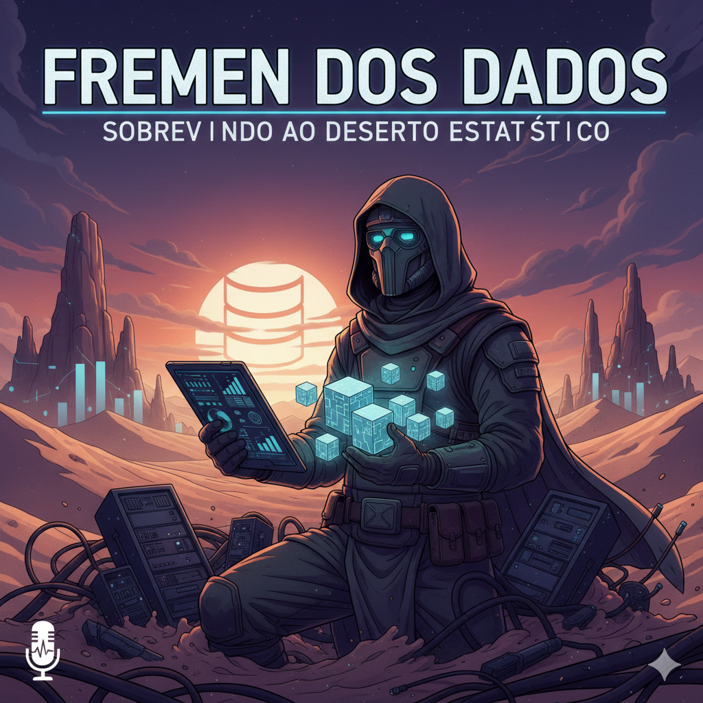

  

<h1 align="center">Projeto Podcast Gerado por I.A.s</h1>

  🤖✨ Crie um podcast do zero usando inteligência artificial!

Este repositório documenta um projeto desenvolvido durante uma live no YouTube em parceria com a [DIO](https://dio.me). O objetivo foi explorar o potencial de ferramentas de IA para gerar um podcast completo, desde o roteiro até a produção final. A metodologia se baseia em uma **esteira de prompts** otimizada para cada etapa do processo criativo.

---

## 🎧 Ouça um trecho do podcast

  

    Para ouvir, faça o download do episódio:
    <a href="./output/Ep1_Conceitos_basicos.mp3" download>
      Episódio 1 - Conceitos Básicos (.mp3)
    </a>
  

---

## 💻 Tecnologias Utilizadas

Este projeto foi construído com a ajuda de diversas ferramentas de IA e edição:

* **[ChatGPT](https://chat.openai.com/) & [Gemini](https://gemini.google.com/):** Para a criação do roteiro e a geração de ideias.
* **[ElevenLabs](https://beta.elevenlabs.io/):** Para a síntese de voz a partir do texto do roteiro.
* **[Capcut](https://www.capcut.com/pt-br/):** Para a edição do áudio, adição de trilha sonora e efeitos sonoros.
* **[Midjourney](https://www.midjourney.com/):** Utilizado para a criação da arte de capa do podcast.

---

## ✨ Como foi feito?

Cada etapa do processo foi cuidadosamente orquestrada por meio de prompts para as IAs:

1.  **Roteiro:** Gerado utilizando o ChatGPT, com prompts específicos para estruturar o conteúdo do episódio.
2.  **Áudio:** O texto do roteiro foi transformado em voz sintética pela ElevenLabs.
3.  **Edição:** O áudio bruto foi aprimorado no Capcut, onde foram adicionados sons de fundo, trilha sonora e efeitos.
4.  **Arte de Capa:** A arte visual foi criada pelo Midjourney, garantindo uma identidade visual única para o projeto.

---

## 📚 Materiais de Apoio

* [**Link da live no YouTube**](https://www.youtube.com): Assista ao passo a passo da criação.
* [**Notion Template**](https://helpful-jump-17b.notion.site/PAS-Podcast-AI-Studio-210489e15d7a4a73b743bb159e45d06f?pvs=4): Acesse o guia completo com todos os prompts e instruções detalhadas.

---

## 🛠️ Instruções de Execução

Para replicar o projeto e criar seu próprio podcast, siga o fluxo de trabalho detalhado no **Notion Template** e utilize os seguintes passos:

1.  **Roteiro:** Utilize os prompts de roteiro no ChatGPT.
2.  **Voz:** Use o texto gerado no ChatGPT como input para a ElevenLabs.
3.  **Arte:** Crie as artes do podcast usando os prompts específicos no Gemini.

---

## 👨‍💻 Expert

  

  <a href="https://github.com/Cleyton-Nobre">GitHub</a>
  &nbsp;|&nbsp;
  <a href="www.linkedin.com/in/cleyton-nobre/">LinkedIn</a>

